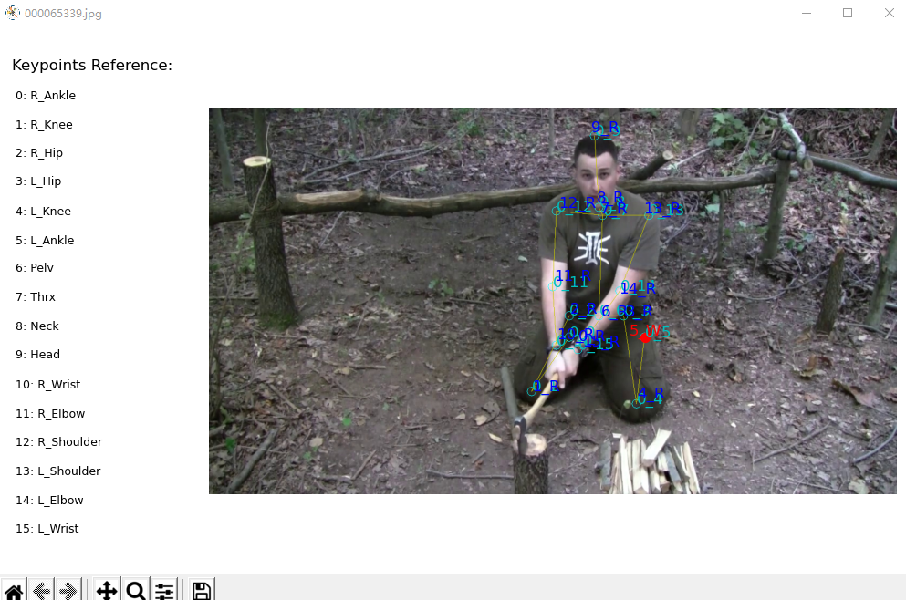
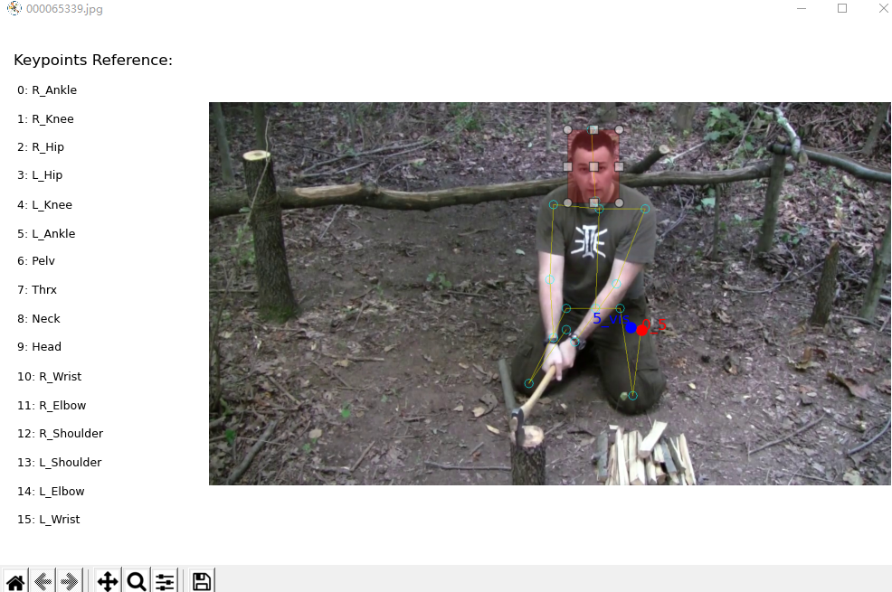

# AI Human Co-Labeling Toolbox (AH-CoLT) 

This is the code for the following paper:

X. Huang, B. Rezaei and S. Ostadabbas, “AH-CoLT: An AI-Human Co-Labeling Toolbox to Augment Efficient Groundtruth Generation” 

The goal of the AH-CoLT is to provide an efficient and augmentative annotation tool to facilitate creating large labeled visual datasets.
This toolbox presents an efficient semi-automatic groundtruth generation framework for unlabeled images/videos. 
AH-CoLT enables accurate groundtruth labeling by incorporating the outcomes of state-of-the-art AI recognizers into a time-efficient human-based review and revise process.

Now we integrate different 2D annotation models into toolbox:
1. **Hourglass**: Single person 16 keypoints annotation in MPII fasion based on Hourglass pose estimation.
2. **Faster RCNN**: Single person 17 keypoints annotation in COCO fashion based on Faster R-CNN pose estimation.
3. **FAN**: Single person 68 facial landmarks based on FAN's face alignment.


Contact: 

[Xiaofei Huang](xhuang@ece.neu.edu),
[Behnaz Rezaei](shawnzhu@ece.neu.edu),
[Sarah Ostadabbas](ostadabbas@ece.neu.edu)


## Contents   
*  [Requirements](#requirements)
*  [Running the GUI](#running-the-gui)
    *  [Stage I: AI Labeler](#stage-i-ai-labeler)
    *  [Stage II: Human Reviewer](#stage-ii-human-reviewer)
    *  [Stage III: Human Reviser](#stage-iii-human-reviser)
*  [Citation](#citation)
*  [License](#license)
*  [Acknowledgements](#acknowledgements)


## Requirements 
The interface of toolbox is developed by tkinter in python3.7 on Ubuntu 18.04.

1. Install following libraries:
    *  (1) [pyTorch](https://pytorch.org/) 1.6 with CUDA 10.1
    *  (2) [detectron2](https://github.com/facebookresearch/detectron2/blob/master/INSTALL.md)
    *  (3) [face-alignment](https://github.com/1adrianb/face-alignment)
2. Run `pip install -r requirements.txt` to install other libraries.
3. Download one of pretrained models (e.g. [8-stack hourglass model](https://drive.google.com/drive/folders/0B63t5HSgY4SQQ2FBRE5rQ2EzbjQ?usp=sharing)) 
and put the model folder into `./Models/Hourglass/data/mpii`.
4. Download a weights file for YOLOv3 detector [here](https://pjreddie.com/media/files/yolov3.weights), and place it into `./Models/Detection/data`.
5. Download one of COCO Person Keypoint Detection models from [Detectron2 Model Zoo](https://github.com/facebookresearch/detectron2/blob/master/MODEL_ZOO.md).  (e.g. [keypoint_rcnn_R_50_FPN_3x](https://dl.fbaipublicfiles.com/detectron2/COCO-Keypoints/keypoint_rcnn_R_50_FPN_3x/137849621/model_final_a6e10b.pkl), and put the file into `./Models/Detectron2/models`.

## Running the GUI
Run `Toolbox.py` to launch main window of AH-CoLT, which includes three stages: AI Labeler, Human Reviewer, and Human Reviser.
For user convenience, each stage can be employed independently.


### Stage I: AI Labeler
AI labeler interface allows users to load a video or a collection of images as the unlabeled data source 
and select an appropriate already trained model as the initial AI labeler. 
The types of labels outputted by the AI model is then displayed in the textbox.

Model Selection:
* Hourglass: 16 MPII keypoints for single-person images.
* Faster R-CNN: 17 COCO keypoints for single-person images.
* FAN: 68 facial landmarks for single-person images.

The "AI Labeler" window


#### Input
Choose a directory of images set or a file of video. Each image could be .jpeg or .png file. The format of video file could be MP4, AVI or MOV.
##### Example:
```
{ROOT}/img
```
#### Output
1. If resource is a video, the corresponding frames will be generated first in folder `${root}/video_name`, which is named the video file name. 
2. Predicted keypoints of all images/frames will be save in `dirname_model.pkl` under root path. Here `dirname` represents 
the name of images/frames set and `model` is the abbreviation of name of selected model.
##### Example:
```
${ROOT}/img_hg.pkl
```

### Stage II: Human Reviewer
In this stage, the output of the AI labeling is given to a human reviewer for his/her evaluation. Reviewer needs check keypoints in order.

#### Input
1. Folder of images/frames set
2. AI predicted keypoint file, which is generated by AI labeler.
#### Output
When all images have been reviewed, a flag list file will be save in `dirname_flag.pkl` under root path. Here `dirname` represents 
the name of images/frames set.
##### Example:
```
${ROOT}/img_flag.pkl
```
The image reviewing window


The format of labels, which represent the AI predicted keypoints, is `poseindex_keypointindex`. 

| Operation | Description |
| --- | --- |
| Click left button of mouse| Accept current predicted keypoint |
| Click right button of mouse | Reject current predicted keypoint |
| Press 'i' on keyboard | Insert a keypoint |
| Press 'd' on keyboard | Delete current keypoint |
| Press 'u' on keyboard | Undo |
| Press 'y' on keyboard | Confirm reviewing of current image (ONLY work after checking all keypoints)
| Press 'n' on keyboard | Recheck current image |

#####Note:
As we default all keypoints visible, if considering the visibility of each keypoint, please mark obscured keypoints as errors, 
so that they can be annotated as invisible.

### Stage III: Human Reviser
In this stage, only the AI model errors detected by the human reviewer need to be revised.

#### Input
1. Folder of images/frames set
2. AI predicted keypoint file, which is generated by AI labeler.
3. Corresponding flag list file, which is generated by Human Reviewer.
#### Output
When all images have been revised, a groundtruth will be save in `dirname_gt.pkl` under root path. Here `dirname` represents 
the name of images/frames set.
##### Example:
```
${ROOT}/img_gt.pkl
```
The image revising window


The keypoints, which need to be revised, are displayed in red. After correcting all keypoints marked as errors in one image, 
human reviser needs to capture the head bounding box by holding and releasing left button to create a pink rectangle. 

| Operation | Description |
| --- | --- |
| Click left button of mouse| Capture the new position of red keypoint and set as 'visible' |
| Click right button of mouse | Capture the new position of red keypoint and set as 'invisible' |
| Press 'u' on keyboard | Undo |
| Hold and release left button of mouse | Create a rectangle box |
| Press 'y' on keyboard | Confirm revising of current image (ONLY work after revising all keypoints and capturing bounding box)

**Note**: In MPII fashion or for the 68 facial landmarks, the rectangle box is created for head bounding box, while it is for body bounding box in COCO fashion.  


## Citation 

## License 
* This code is for non-commercial purpose only. 

* For other uses please contact [Augmented Cognition Lab (ACLab)](http://www.northeastern.edu/ostadabbas/) at Northeastern University. 


## Acknowledgements
1. The person detector is brought from [pytorch-yolo-v3](https://github.com/ayooshkathuria/pytorch-yolo-v3), which is based on 
[YOLOv3: An Incremental Improvement](https://pjreddie.com/media/files/papers/YOLOv3.pdf).
2. The hourglass pose estimation for AI Labeler comes from [pytorch-pose](https://github.com/bearpaw/pytorch-pose).
3. The Faster R-CNN pose estimation for AI Labeler comes from [Detectron2](https://github.com/facebookresearch/detectron2)
4. The facial landmarks detector comes from [face-alignment](https://github.com/1adrianb/face-alignment)


